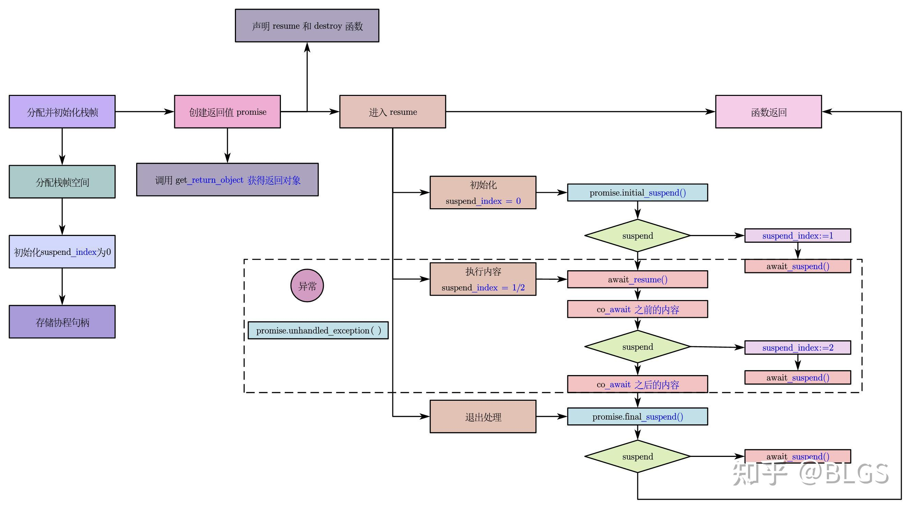
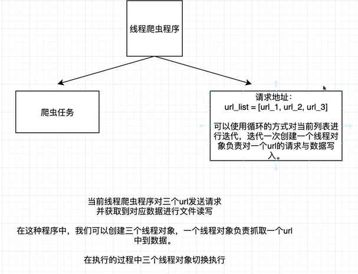
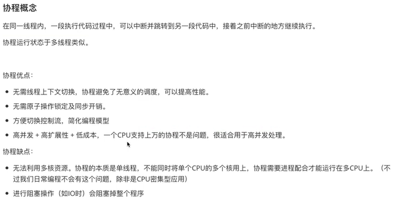
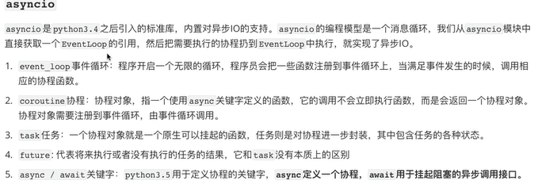

* 可迭代对象和迭代器
  * **Iterable Objects**
    * 在任何的编程语言中，都是具有这个可迭代对象的
    * 只要数据类型中定义了可以返回迭代器的 `__iter__` 方法
    * 那么该对象就是可迭代对象了
    * ***
    * 或者说定义了可以支持 `__getitem__` 方法
    * 那么他也是一个可迭代对象
    * 可迭代对象是可以通过 for 循环实现遍历的对象
    * ***
    * 可迭代对象含有： list tuple set 等等
    * dir(数据实例) 即可获取内部实现了的方法
  * **Iterator**
    * 就是同时实现了我们的 `__next__` 方法 和 `__iter__` 方法的就是我们的
    * **迭代器对象**， `__iter__` 方法实现的是返回自身， `__next__` 实现的是不断返回下一个值
    * 直到我们的可迭代对象为空，这个时候就直接返回，终止迭代
    * 可迭代对象不一定是迭代器，迭代器一定是可迭代对象
    * 工厂模式是可以实现节省内存空间的
    * itertools
    * `__iter__` 方法决定了我们的一个对象是否可迭代

* 生成器对象
  * **Generator Object**
  * 
  * 就是一种十分特殊的迭代器，只是使用一个 yield 关键字
  * 同时这样的对象是具备一些特性的，就是我们的 `__iter__` 和 `__next__` 的特性
  * 程序每次遇见了 **yield** 都会返回结果，并且实现保留函数的执行状态
  * 并且实现返回上一句的函数执行开始实现执行,同时实现返回 **yield** 结果, 和 return 是十分相似的
  * 
  * 生成器的预激活机制
  * send 方法: 就是向 `__next__` 方法来实现调用生成器
  * 同时实现的是向其传输数据

* 携程的概念和特性
  * **Coroutine**
  * 轻量级的线程
  * https://zhuanlan.zhihu.com/p/594054337
  * 协程和线程其实非常相似，但是协程是协助式多任务的，线程则是抢占式多任务的
  * 协程切换在一定程度上是可控的，能够预知的，所以不需要通过同步性原语（信号量等）保护临界资源。
  * 
  * 在同一个线程中，不同的子程序是可以实现不断的中断执行并且执行下一个语句的形式
  * 携程是具有属于自己的寄存器上下文和栈
  * 同时省去了不同的线程之间的不断的切换带来的性能消耗

* asyncio 异步的 IO 框架
  * 就是一种异步的操作的机制，同时也是具有那个同步的 IO 机制的
  * 同步的 IO 就是我们的线程遇到 IO 操作后，线程必须等待 IO 操作的完成后才可以拿到结果
  * 异步的 IO 就是我们的线程遇到 IO 操作后，线程就不用等待 IO 操作的完成，系统通知其完成后再回来处理
  * 就是实现的是对异步 IO 的一种操作
  * 
  * 使用框架开发的意义就是实现的是让我们开发中可以注重的是业务逻辑的开发
  * 不用太注重于内部的底层的复杂逻辑的使用，大大简化了我们的开发难度
  *
  *  
  * async 和 await 关键字的使用
  * 然后使用 asyncio.run() 来实现调用需要执行的函数
  * 
  * 
  * asyncio 的底层是基于生成器实现的，生成器函数是不会立即执行的，其会返回一个生成器对象，
  * 通过这个对象来执行生成器函数的，生成器函数需要通过 send 或者 next 方法实现调度
  * 