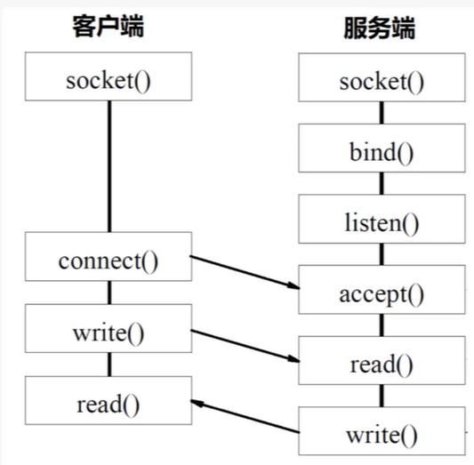
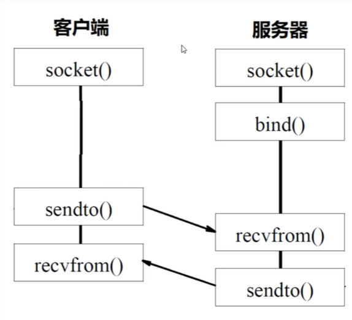
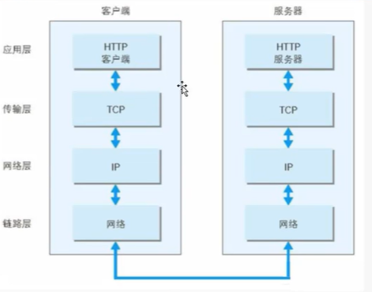
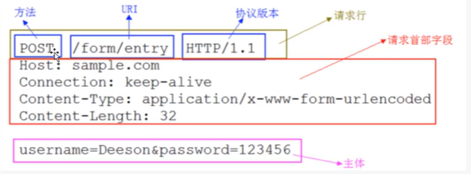
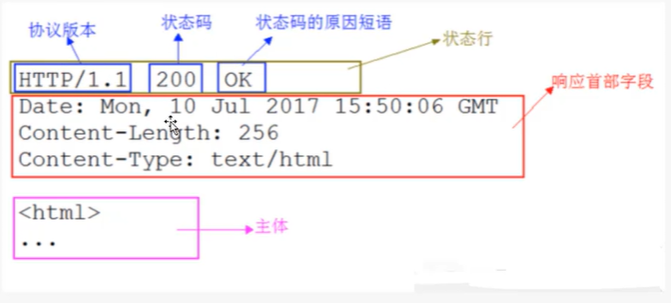

## Python Network Protool

### 网络协议基础

> 互联网的本质的话就是一些协议来实现组成的，网络协议实现了我们的多人之间的通信以及沟通
>
> 一般的协议类型的话含有我们的 TCP 和 UDP 协议类型
>
> 通信协议一般就是由我们的分层协议来实现组成的

> ### TCP 协议的基本构成
>
> * 应用层（**Application layer**）
> * 传输层（**Transport layer**）
> * 网络层（**Network Layer**）
> * 链接层（**Link Layer**）
> * 实体层（**Physical Layer**）
>
> 
>
> **实体层**： 就是实现的是我们的将设备之间连接起来，实现我们的 0 和 1 之间的数据之间的传输，光缆或者说其他的电线组成
>
> **链接层**：就是实现的是规定实现解读 0 和 1 的编译字符的方式，实现有效的分组
>
> **网络层**：就是实现的是我们的是确定我们的主机的 IP 地址，通过我们的这个 IP 来实现访问我们的主机，对外进行路由转发
>
> **传输层**：就是实现的是确定访问的端口号
>
> **应用层**：就是实现的是我们的将数据进行解读，呈现给用户进行使用

> ### 传输层
>
> 我们的传输层主要i包含的两种协议类型： 
>
> * TCP 面向连接的可靠协议
> * UDP 面向无连接的协议

### TCP 和 UDP 协议

> ### TCP 协议的三次握手过程
>
> * 基本的步骤
>   * 第一次握手： **主机A** 通过向 **主机B** 发送一个带有**特殊标志位的数据段**给主机B，向**主机B请求建立连接**
>     * **即是说就是我们向另一个主机发送一个请求的申请**
>   * 第二次握手：主机B 接收到了连接请求后，也是用一个带有**特殊标志位的数据段**来响应 主机A
>     * **就是另一个主机对其的发送请求的申请表示统一的过程**
>   * 第三次握手： 主机A 接收到 主机B 的同意后，再发送一次确定应答，确定已经接收到了主机B 的数据段
>     * **就是相当是我们的进行确定的信号**
>
>   
>
>   
>
>   * **回想一哈你 QQ 添加别人好友的操作：** 
>     * 先发送的是请求添加好友的信息给对方
>     * 然后实现的是另一方确定添加好友
>     * 最后就是 QQ 实现自动的回复 “我们已经是好友了，请开始互动吧！！！”
>
> 
>
> * **TCP 协议的好处就是：**
>   * 可以保证我们的进行联系的双方确保真真的保持了联系
>   * 然后确保了在连接的时候的数据传输的不丢失
>   * 但是一定程度上导致了性能的消耗
>
> 
>
> * **UDP 协议的话**
>   * 没有建立联系直接进行交互
>   * 没有对传输数据的安全保证，数据可能丢失
>   * 但是性能消耗不大，双方之间可以实现十分便利的交流

> ### TCP 协议的深入
>
> 
>
> * **seq**:  数据序号，占用 32 个字节大小，存储的是本报文段发送的数据的第一个字节序号
> * **ack**:  确定序号，占用 32 个字节大小， 期望收到对方的下一个报文段的数据的第一个字节的序号
> * A: **ACK** 当我们的 ACK == 1 的时候，确认序号才有效，如果为 0，那就无效
> * S: **SYN** 同步标志位，用来进行标识的是这是一个连接请求还是一个连接接受的请求
> * F: **FIN** 结束标志位，FIN == 1 的时候，表示此报文段的发送端的数据已经发送完成，并要求释放连接

> ### TCP 协议的三次握手和四次挥手
>
> 
>
> * 主动发送请求连接的是 客户端， 被动接收请求的是服务端
> * 在这个过程中，需要进行三次的 TCP 之间的报文的交换工作，这个就是三次握手
> * 同时在这个过程中，在断开连接的时候，需要进行四次的报文交换工作，这个就是四次挥手
>
> 

### Socket 编程

> socket  就是我们的进行网络传输数据的数据的一种套接字
>
> 他是基于 TCP/IP 实现的一种用来实现不同主机之间的双向进程间的通讯的一种编程接口

> socket 的连接过程：
>
> * 服务端的监听
>   * 等待连接的状态，实现实时的监听网络连接请求
> * 客户端请求
>   * 客户端套接字提出连接请求，指定需要进行连接的服务端的 IP 地址以及端口，进行连接
> * 连接确认
>   * 通过服务器端确认客户端的连接成功，然后服务端一直处于监听状态，监听别的客户端的请求

#### 实现发送 TCP 的流程

#### 实现发送 UDP 流程

### HTTP协议基础

> **HTTP** 协议，是一种超文本传输协议， **Hyper Text Transfer Protocol**

#### HTTP 的工作原理

#### **HTTP请求响应模型**

> * 服务端和客户端之间建立 TCP 连接，默认使用的是 80 端口
> * 客户端向服务器发送请求命令
> * 客户端发送请求头信息
> * 服务器做出对应的应答
> * 服务器返回响应头信息
> * 服务器会向客户端发送数据
> * 服务器关闭 TCP 连接，通过 Connecttion:keep-alive 来实现客户端和服务端之间保持连接的活跃性

#### **HTTP的相关特性**

> * **HTTP** 通过的是我们的请求和响应的交换来达成通信
> * **HTTP** 是一个无状态的协议，所以说就不会对数据进行记忆，长时间的保存（这个也是后面 cookie 和 session 出现的原理）
>   * cookie 和 session 是用来实现保存管理通信状态的两种含有状态的协议类型
>   * **cookie** 是用来实现保存在我们的客户端的一种具有状态的信息
>   * **session** 是用来实现保存在我们的服务端的一种具有状态的信息
> * **HTTP** 使用 URL 来进行我们的资源的定位，通常是含有三各部分组成
>   * 资源访问机制： http | https
>   * 存放主机的域名或者 IP 地址 : ip地址
>   * 资源自身的名称： 后面进行访问的资源的路径
> * **HTTP** 通过HTTP 方法来告诉服务器我们进行访问的意图
>   * GET 方法： 就是实现的是我们的获取服务器中的对应的静态资源
>     * GET 请求的数据回复加在 URL 之后进行拼接实现请求，使用 `?` 将 URL 和 参数进行分割，用 `&` 进行参数的拼接
>     * 参数值为**英文字母或则数字**的时候，默认的话就是直接原样子进行发送
>     * 参数值为**空格**的话，就转义为 `+`
>     * 参数值为**中文**的话，则进行 BASE64 进行加密
>   * POST 方法:  就是实现的是向服务器提交数据用的，常用于进行用户注册或者登录的时候进行使用
>     * POST 进行提交数据的时候，比 GET 方法更加的安全
>     * GET 请求是以明文的格式实现的呈现
>     * 但是 POST 是通过请求体中进行提交数据的，URL 中式无法进行查看这些信息的
> * **HTTP** 是一种持久性的连接
>   * `Connection: keep-live` 就是表示的持久性的和服务器之间进行连接
> * **HTTP** 是可以实现短线化连接的传输访问

#### HTTP 报文解析

> **请求（request）报文解析**
>
> * **请求首行** —— 包含了请求的方法，请求的URL 以及 请求的 HTTP 版本信息
> * **请求头** —— 包含了发送请求时候发送的请求的 **headers** 字段的设置
> * **空白行** —— 必须含有的
> * **请求体** —— 就是进行向服务器提交的数据的整体的内容
>
> **响应（response）报文解析**
>
> * **响应首行** —— HTTP的版本信息  |   响应状态码   |    响应状态码描述信息
> * **响应头** ——  返回的 **headers** 字段
> * **空白行** ——  必要的
> * **响应体** ——   静态资源部分，**response**

