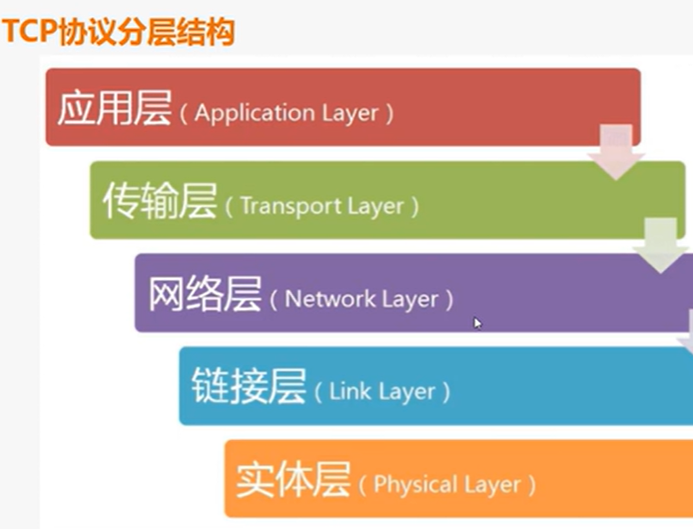
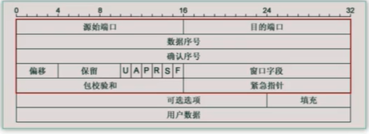
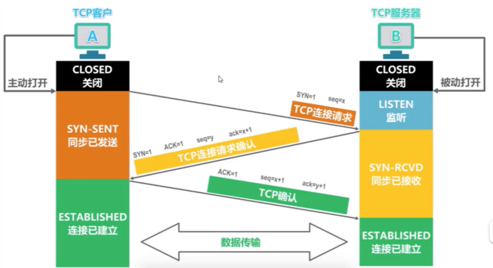
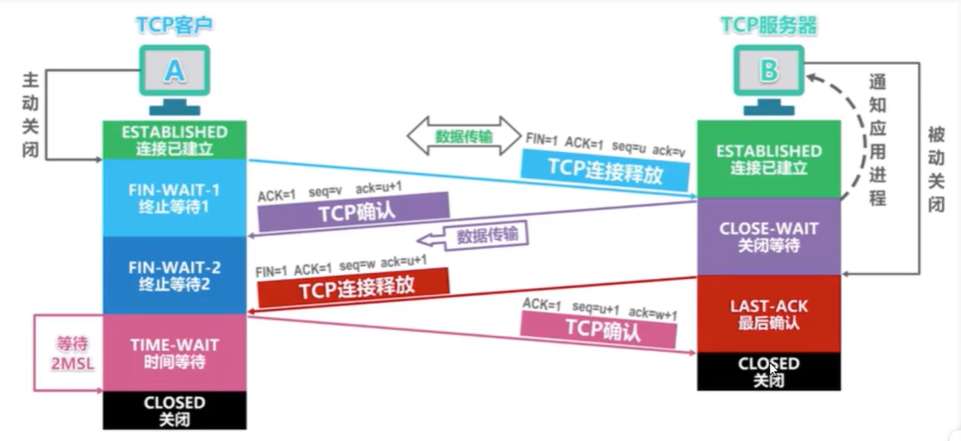

## Python Network Protool

### 网络协议基础

> 互联网的本质的话就是一些协议来实现组成的，网络协议实现了我们的多人之间的通信以及沟通
>
> 一般的协议类型的话含有我们的 TCP 和 UDP 协议类型
>
> 通信协议一般就是由我们的分层协议来实现组成的

> ### TCP 协议的基本构成
>
> * 应用层（**Application layer**）
> * 传输层（**Transport layer**）
> * 网络层（**Network Layer**）
> * 链接层（**Link Layer**）
> * 实体层（**Physical Layer**）
>
> 
>
> **实体层**： 就是实现的是我们的将设备之间连接起来，实现我们的 0 和 1 之间的数据之间的传输，光缆或者说其他的电线组成
>
> **链接层**：就是实现的是规定实现解读 0 和 1 的编译字符的方式，实现有效的分组
>
> **网络层**：就是实现的是我们的是确定我们的主机的 IP 地址，通过我们的这个 IP 来实现访问我们的主机，对外进行路由转发
>
> **传输层**：就是实现的是确定访问的端口号
>
> **应用层**：就是实现的是我们的将数据进行解读，呈现给用户进行使用

> ### 传输层
>
> 我们的传输层主要i包含的两种协议类型： 
>
> * TCP 面向连接的可靠协议
> * UDP 面向无连接的协议

### TCP 和 UDP 协议

> ### TCP 协议的三次握手过程
>
> * 基本的步骤
>   * 第一次握手： **主机A** 通过向 **主机B** 发送一个带有**特殊标志位的数据段**给主机B，向**主机B请求建立连接**
>     * **即是说就是我们向另一个主机发送一个请求的申请**
>   * 第二次握手：主机B 接收到了连接请求后，也是用一个带有**特殊标志位的数据段**来响应 主机A
>     * **就是另一个主机对其的发送请求的申请表示统一的过程**
>   * 第三次握手： 主机A 接收到 主机B 的同意后，再发送一次确定应答，确定已经接收到了主机B 的数据段
>     * **就是相当是我们的进行确定的信号**
>
>   
>
>   
>
>   * **回想一哈你 QQ 添加别人好友的操作：** 
>     * 先发送的是请求添加好友的信息给对方
>     * 然后实现的是另一方确定添加好友
>     * 最后就是 QQ 实现自动的回复 “我们已经是好友了，请开始互动吧！！！”
>
> 
>
> * **TCP 协议的好处就是：**
>   * 可以保证我们的进行联系的双方确保真真的保持了联系
>   * 然后确保了在连接的时候的数据传输的不丢失
>   * 但是一定程度上导致了性能的消耗
>
> 
>
> * **UDP 协议的话**
>   * 没有建立联系直接进行交互
>   * 没有对传输数据的安全保证，数据可能丢失
>   * 但是性能消耗不大，双方之间可以实现十分便利的交流

> ### TCP 协议的深入
>
> 
>
> * **seq**:  数据序号，占用 32 个字节大小，存储的是本报文段发送的数据的第一个字节序号
> * **ack**:  确定序号，占用 32 个字节大小， 期望收到对方的下一个报文段的数据的第一个字节的序号
> * A: **ACK** 当我们的 ACK == 1 的时候，确认序号才有效，如果为 0，那就无效
> * S: **SYN** 同步标志位，用来进行标识的是这是一个连接请求还是一个连接接受的请求
> * F: **FIN** 结束标志位，FIN == 1 的时候，表示此报文段的发送端的数据已经发送完成，并要求释放连接

> ### TCP 协议的三次握手和四次挥手
>
> 
>
> * 主动发送请求连接的是 客户端， 被动接收请求的是服务端
> * 在这个过程中，需要进行三次的 TCP 之间的报文的交换工作，这个就是三次握手
> * 同时在这个过程中，在断开连接的时候，需要进行四次的报文交换工作，这个就是四次挥手
>
> 

### Socket 编程

### http协议基础