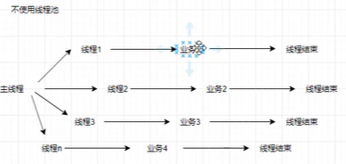
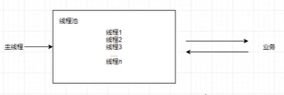

* 线程间的通讯机制
  * 消息队列 --- Queue的使用就是消息队列
  * event 事件对象
    * 实现的是将我们的线程实现在我们自己指定的时间点才开始执行
    * 这个时候，我们的线程的执行便是可控的了
    * 适合的使用场景是将很多的线程全部阻塞，在同一个时间点，将这些线程全部释放运行
    * 形成一种并发的效果
  * Condition 条件对象
    * 由于这种控制事件的处理模式，本身就具备锁的概念
    * 所以说这种的使用场景是我们的控制线程轮流执行的情形

* 线程中的消息隔离机制
  * 消息隔离机制就是使用我们的线程内部的全局变量
  * 就是我们的 threading.local()
  * 这个变量就是处于的是我们的全局变量和局部变量之间的一个变量
  * 这个时候每一个线程中的本地的这个值就是只是属于本线程的变量，就不会相互影响

* 线程池和进程池
  * 线程池
    * 线程池: 里面实现的是存放大量的线程，一旦我们的线程池实现了产生
    * 这个时候就会向这个线程池中添加这个线程
    * 线程池中每一个线程运行完后，不会立即的被销毁
    * 而是实现的是我们的重新回归线程池中
    * 这样的好处就是减少了线程的重新创建带来的成本，同时得到重复的使用
    * 
    * 
    * 
    * concurrent.futures 中的 ThreadPoolExecutor
    * 线程池中常用方法有
      * as_completed
      * map
      * wait
  * 进程池
    * concurrent.futures 中的 ProcessPoolExecutor